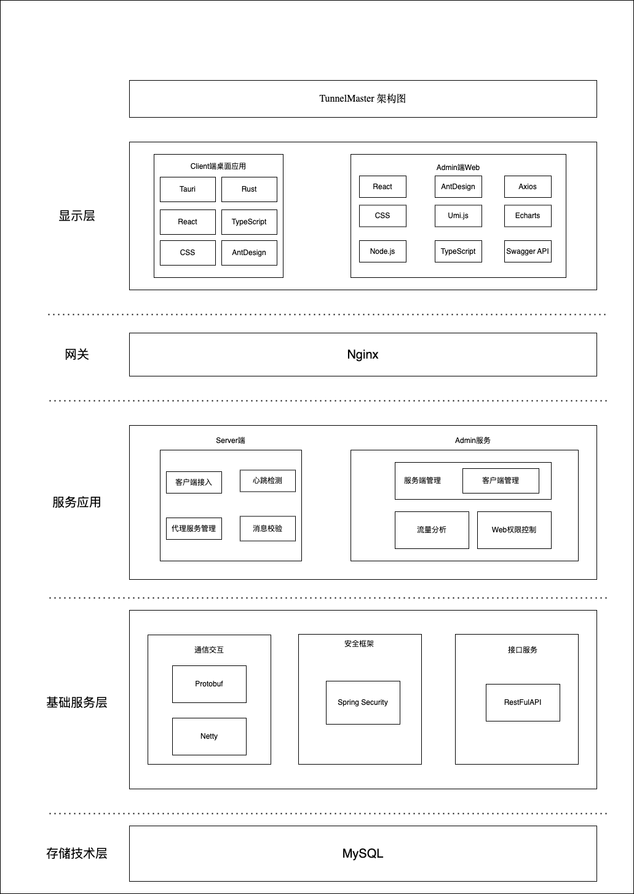
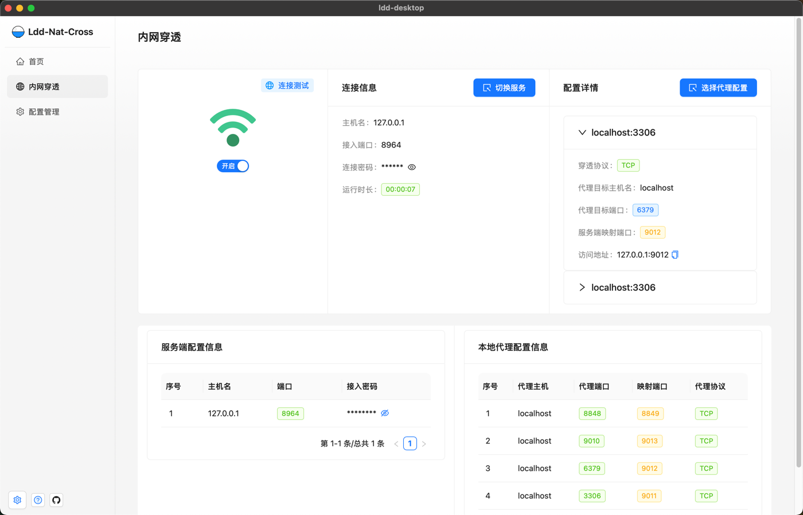
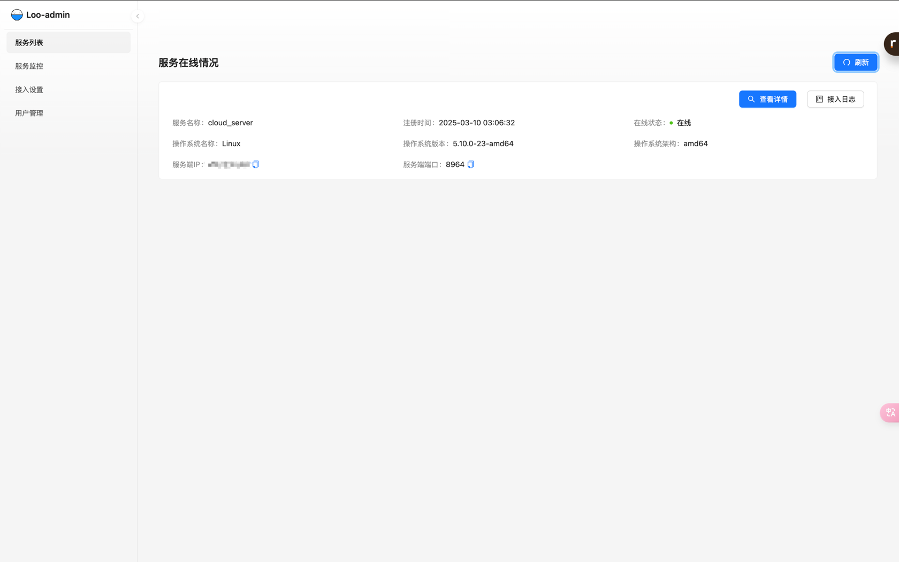
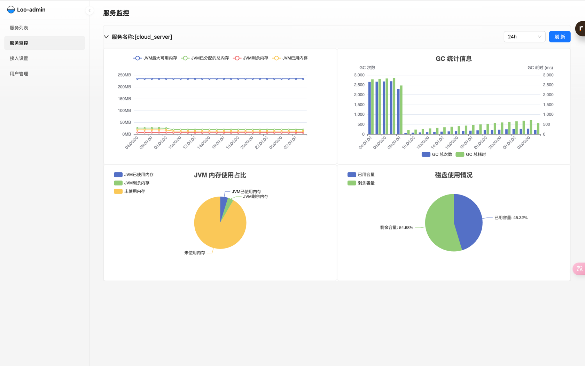
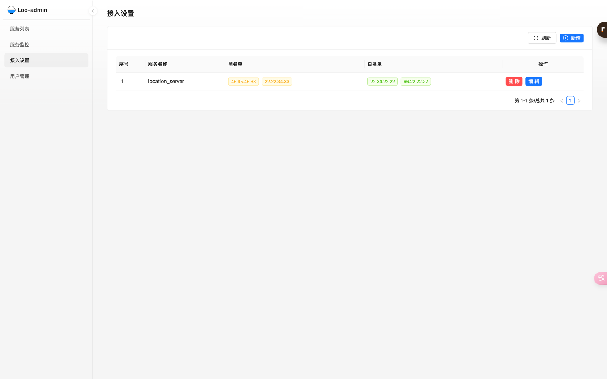
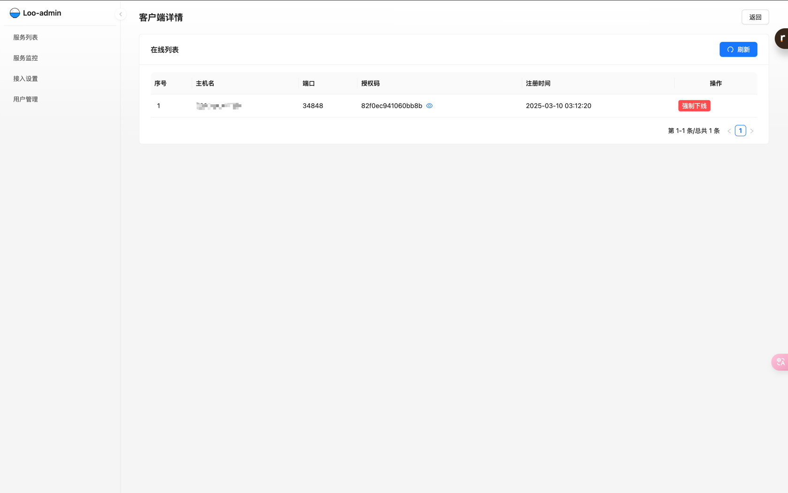

# 项目介绍

&emsp;Loo 是一款操作简单的内网穿透工具，支持多个客户端接入同一个服务端。

### 核心功能(开发中)

- [x] TCP 穿透
- [x] 桌面端客户端
- [x] C/S 端监控
- [x] admin 端的操作控制
- [ ] UDP 穿透

### 配置文件参考

&emsp;C/S 端都是基于 SpringBoot 实现的，因此配置文件格式与 SpringBoot 配置文件无异。

#### 服务端:

```yaml
server:
  port: 8964
  password: 123456
```

- `server.port`: 必填。服务端对外暴露的端口，供客户端接入.
- `server.password`: 必填。密码，客户端接入时认证

#### 客户端:

```yaml
client:
  serverHost: localhost
  serverPort: 8964
  password: 123456
  proxies:
    - host: localhost
      port: 4456
      protocol: tcp
      openPort: 8890
    - host: localhost
      port: 9011
      protocol: tcp
      openPort: 8891
    - host: localhost
      port: 3306
      protocol: tcp
      openPort: 3361
```

- `client.serverHost`: 必填。服务端主机名称；
- `client.serverPort`: 必填。服务端端口；
- `client.password`: 必填。接入服务端时需要的密码，用于接入认证；
- `client.proxies`: 必填。内网代理配置，支持多选；
  - host: 必填。内网主机（应用程序）
  - port: 必填。端口
  - openPort: 必填。服务端暴露的端口

### 启动

&emsp;与启动 SpringBoot 项目无异。可以在 jar 包所在位置创建一个 config 目录，config 目录下放配置文件.

#### 服务端

```shell
java -jar server.jar
```

#### 客户端(Java 版)

```shell
java -jar client.jar
```

#### 客户端(桌面版)

> 待发布

## 技术栈说明

- 底层协议: `Protobuf`
- 服务端：`SpringBoot、Netty、SpringSecurity、MySQL`
- 客户端(Rust)：`Tauri、Tokio、React、Umi.js`

## 架构图



## 目录介绍

- ui: 管理端页面
- admin: 管理端后端
- core: Java Client/Server 的核心通用模块
- server: Java 版 Server
- client: Java 版 Client
- desktop: 基于 tauri 实现的桌面应用
- rclient: Rust 版 Client


## 效果图

### 客户端桌面版





### 管理端







